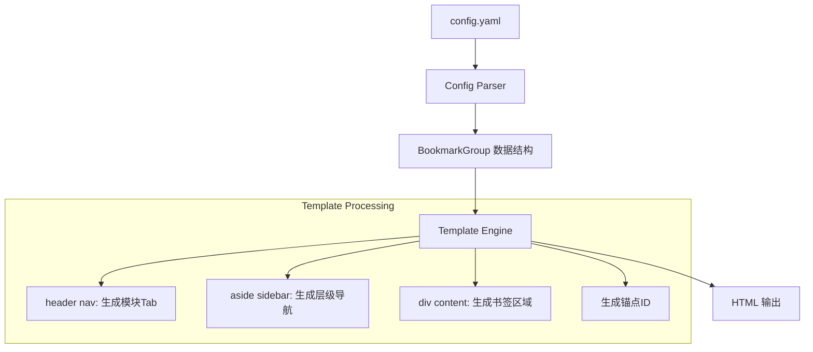

# Design Document: Bookmark Navigation UI

## Overview

本设计文档描述书签导航UI的更新方案。基于现有HTML结构进行改造：
- `<header>` - 模块Tab导航（bookmark下每个顶级列表是一个模块）
- `<aside class="sidebar">` - 层级导航（一级：模块下的groups，二级：groups下的嵌套groups）
- `<div class="content">` - 书签展示区域（显示当前模块下所有书签）

### 设计目标

1. 模块化展示 - bookmark下每个顶级项作为独立模块，在header中切换
2. 层级导航 - sidebar显示当前模块的一级（groups）和二级（嵌套groups）导航
3. 锚点定位 - 点击sidebar导航项平滑滚动到content对应书签区域
4. 保持现有结构 - 复用现有HTML元素和CSS类名

## Architecture

```
┌─────────────────────────────────────────────────────────────┐
│                     <header>                                 │
│  <nav>                                                       │
│    [模块1] [模块2] [模块3] ...              [搜索框]         │
│  </nav>                                                      │
├─────────────────┬───────────────────────────────────────────┤
│ <aside sidebar> │         <div class="content">              │
│                 │                                            │
│  ▼ 一级导航1    │   ┌─────────────────────────────────┐     │
│    · 二级1      │   │  模块直属书签区域                │     │
│    · 二级2      │   │  [书签卡片] [书签卡片]           │     │
│  ▼ 一级导航2    │   └─────────────────────────────────┘     │
│    · 二级1      │   ┌─────────────────────────────────┐     │
│                 │   │  一级分组标题                    │     │
│                 │   │  [书签卡片] [书签卡片]           │     │
│                 │   │  ── 二级分组标题 ──              │     │
│                 │   │  [书签卡片] [书签卡片]           │     │
│                 │   └─────────────────────────────────┘     │
├─────────────────┴───────────────────────────────────────────┤
│                     <footer>                                 │
└─────────────────────────────────────────────────────────────┘
```

### 层级映射关系

```
config.yaml                    UI展示
─────────────────────────────────────────────────────
bookmark:                      
  - name: "开发工具"           → header nav <a> 模块Tab
    items: [...]               → content 模块直属书签
    groups:                    
      - name: "Python资源"     → sidebar 一级导航 (tree-toggle)
        items: [...]           → content 一级分组书签
        groups:                
          - name: "PyPI"       → sidebar 二级导航 (tree-link)
            items: [...]       → content 二级分组书签
```

### 数据流



## Components and Interfaces

### 1. 模板数据结构

现有的Go数据结构已经支持所需的层级关系，无需修改：

```go
// BookmarkItem - 单个书签
type BookmarkItem struct {
    Name string `yaml:"name"`
    URL  string `yaml:"url"`
    Icon string `yaml:"icon,omitempty"`
}

// BookmarkGroup - 书签组（支持嵌套）
type BookmarkGroup struct {
    Name   string          `yaml:"name"`
    Items  []BookmarkItem  `yaml:"items,omitempty"`
    Groups []BookmarkGroup `yaml:"groups,omitempty"`
}
```

### 2. 模板变量接口

```go
// TemplateData - 传递给模板的数据
type TemplateData struct {
    Title       string           // 页面标题
    AllGroups   []BookmarkGroup  // 所有模块（顶级bookmark列表）
    ActiveGroup *BookmarkGroup   // 当前激活的模块
}
```

### 3. HTML组件结构（基于现有模板）

#### 3.1 Header组件 - 模块Tab导航

保持现有`<header><nav>`结构，每个模块生成一个Tab链接：

```html
<header>
    <nav>
        {{range .AllGroups}}
        <a href="{{.Name}}.html"{{if eq .Name $.ActiveGroup.Name}} class="active"{{end}}>{{.Name}}</a>
        {{end}}
        <input type="text" class="search-input" placeholder="搜索网站...">
    </nav>
</header>
```

#### 3.2 Sidebar组件 - 层级导航

基于现有`<aside class="sidebar">`和`tree-item`结构：
- 一级导航：当前模块(ActiveGroup)下的groups → `tree-toggle`
- 二级导航：一级groups下的嵌套groups → `tree-link`

```html
<aside class="sidebar">
    <ul class="tree-item">
        {{range $idx, $group := .ActiveGroup.Groups}}
        <li>
            <!-- 一级导航：groups名称 -->
            <div class="tree-toggle{{if eq $idx 0}} open{{end}}" onclick="toggleTree(this)">
                <span class="arrow">▶</span>{{$group.Name}}
            </div>
            <ul class="tree-children{{if eq $idx 0}} open{{end}}">
                <!-- 一级直属书签作为链接（可选） -->
                {{range $group.Items}}
                <li><a href="#section-{{$group.Name}}" class="tree-link">{{.Name}}</a></li>
                {{end}}
                <!-- 二级导航：嵌套groups名称 -->
                {{range $group.Groups}}
                <li><a href="#section-{{.Name}}" class="tree-link">{{.Name}}</a></li>
                {{end}}
            </ul>
        </li>
        {{end}}
    </ul>
</aside>
```

#### 3.3 Content组件 - 书签展示区

基于现有`<div class="content">`结构，展示当前模块所有书签：

```html
<div class="content">
    {{if .ActiveGroup}}
    <!-- 模块标题 -->
    <div class="category-title">{{.ActiveGroup.Name}}</div>

    <!-- 模块直属书签 -->
    {{if .ActiveGroup.Items}}
    <div id="section-{{.ActiveGroup.Name}}" class="nav-grid">
        {{range .ActiveGroup.Items}}
        <a class="nav-card" href="{{.URL}}" target="_blank">
            <div class="nav-header">
                {{if .Icon}}{{end}}
                <div class="nav-title">{{.Name}}</div>
            </div>
            <div class="nav-url">🔗 {{.URL}}</div>
        </a>
        {{end}}
    </div>
    {{end}}

    <!-- 一级分组书签 -->
    {{range .ActiveGroup.Groups}}
    <div id="section-{{.Name}}" class="category-title">{{.Name}}</div>
    
    <!-- 一级直属书签 -->
    {{if .Items}}
    <div class="nav-grid">
        {{range .Items}}
        <a class="nav-card" href="{{.URL}}" target="_blank">
            <div class="nav-header">
                {{if .Icon}}{{end}}
                <div class="nav-title">{{.Name}}</div>
            </div>
            <div class="nav-url">🔗 {{.URL}}</div>
        </a>
        {{end}}
    </div>
    {{end}}
    
    <!-- 二级分组书签 -->
    {{range .Groups}}
    <div id="section-{{.Name}}" class="category-title" style="font-size:16px;">{{.Name}}</div>
    <div class="nav-grid">
        {{range .Items}}
        <a class="nav-card" href="{{.URL}}" target="_blank">
            <div class="nav-header">
                {{if .Icon}}{{end}}
                <div class="nav-title">{{.Name}}</div>
            </div>
            <div class="nav-url">🔗 {{.URL}}</div>
        </a>
        {{end}}
    </div>
    {{end}}
    {{end}}
    {{end}}
</div>
```

### 4. JavaScript交互组件

#### 4.1 现有树形展开（保持不变）

```javascript
function toggleTree(element) {
    element.classList.toggle('open');
    const children = element.nextElementSibling;
    if (children) {
        children.classList.toggle('open');
    }
}
```

#### 4.2 平滑滚动到锚点（新增）

```javascript
// 点击sidebar链接时平滑滚动
document.querySelectorAll('.tree-link[href^="#"]').forEach(link => {
    link.addEventListener('click', function(e) {
        e.preventDefault();
        const targetId = this.getAttribute('href').substring(1);
        const target = document.getElementById(targetId);
        if (target) {
            target.scrollIntoView({ behavior: 'smooth', block: 'start' });
        }
    });
});
```

#### 4.3 滚动时高亮当前导航（新增）

```javascript
// 监听滚动，高亮当前可见区域对应的导航
const observer = new IntersectionObserver((entries) => {
    entries.forEach(entry => {
        if (entry.isIntersecting) {
            const id = entry.target.id;
            document.querySelectorAll('.tree-link').forEach(link => {
                link.classList.remove('active');
                if (link.getAttribute('href') === '#' + id) {
                    link.classList.add('active');
                }
            });
        }
    });
}, { threshold: 0.5 });

document.querySelectorAll('[id^="section-"]').forEach(section => {
    observer.observe(section);
});
```

## Data Models

### 配置数据层级映射

```yaml
bookmark:                          # 根配置
  - name: "模块A"                  # 模块（header nav Tab）
    items: [...]                   # 模块直属书签（content显示）
    groups:                        # 一级导航（sidebar tree-toggle）
      - name: "一级1"
        items: [...]               # 一级直属书签（content显示）
        groups:                    # 二级导航（sidebar tree-link）
          - name: "二级1"
            items: [...]           # 二级书签（content显示）
```

### 锚点ID生成规则

| 层级 | ID格式 | 示例 |
|------|--------|------|
| 模块直属 | `section-{模块名}` | `section-开发工具` |
| 一级分组 | `section-{一级名}` | `section-Python资源` |
| 二级分组 | `section-{二级名}` | `section-PyPI文档` |

### CSS类命名规范（复用现有）

| 组件 | 类名 | 用途 |
|------|------|------|
| 模块Tab | `nav a` | header中的模块切换链接 |
| 一级导航 | `.tree-toggle` | sidebar一级菜单（可展开） |
| 二级导航 | `.tree-link` | sidebar二级菜单链接 |
| 书签区块 | `.category-title` | content区域分组标题 |
| 书签卡片 | `.nav-card` | 单个书签展示卡片 |
| 书签网格 | `.nav-grid` | 书签卡片网格布局 |


## Correctness Properties

*A property is a characteristic or behavior that should hold true across all valid executions of a system—essentially, a formal statement about what the system should do. Properties serve as the bridge between human-readable specifications and machine-verifiable correctness guarantees.*

### Property 1: Module Count Consistency

*For any* valid bookmark configuration, the number of rendered module tabs in the HTML output SHALL equal the number of top-level bookmark groups in the configuration.

**Validates: Requirements 1.1**

### Property 2: Complete Bookmark Rendering

*For any* bookmark module and its complete hierarchy of items, all bookmark items (at module level, primary group level, and secondary group level) SHALL appear in the rendered content area.

**Validates: Requirements 1.2, 4.1**

### Property 3: Sidebar Hierarchy Consistency

*For any* bookmark module with nested groups, the sidebar SHALL contain:
- One primary navigation entry for each direct child group
- One secondary navigation entry for each nested group within primary groups

**Validates: Requirements 1.3, 2.1, 3.1**

### Property 4: Empty Navigation Handling

*For any* bookmark module containing only items (no groups), the sidebar SHALL render no navigation entries. *For any* primary group containing only items (no nested groups), no secondary navigation entries SHALL appear under it.

**Validates: Requirements 2.2, 3.4**

### Property 5: Navigation Order Preservation

*For any* bookmark configuration, the order of navigation items in the sidebar SHALL match the order of groups as defined in the configuration file.

**Validates: Requirements 2.3**

### Property 6: Section Header Accuracy

*For any* bookmark group rendered in the content area, the section header text SHALL exactly match the group name from the configuration.

**Validates: Requirements 4.2**

### Property 7: Icon Rendering Completeness

*For any* bookmark item with an icon URL defined, the rendered HTML SHALL contain an img element with the src attribute matching the icon URL.

**Validates: Requirements 4.3**

### Property 8: Unique Section IDs

*For any* rendered HTML page, all section IDs used for anchor navigation SHALL be unique within the document.

**Validates: Requirements 5.2**

## Error Handling

### 配置错误处理

| 错误场景 | 处理方式 |
|---------|---------|
| 空的bookmark配置 | 显示空状态提示页面 |
| 缺少name字段 | 使用"未命名"作为默认值 |
| 无效的URL格式 | 保留原始URL，由浏览器处理 |
| 缺少icon字段 | 不渲染图标元素 |

### 运行时错误处理

| 错误场景 | 处理方式 |
|---------|---------|
| 锚点ID不存在 | scrollToSection静默失败，不抛出异常 |
| 图标加载失败 | 使用CSS隐藏broken image图标 |
| 搜索无结果 | 显示"无匹配结果"提示 |

## Testing Strategy

### 测试框架

- **单元测试**: Go标准库 `testing`
- **属性测试**: `github.com/leanovate/gopter` (已在项目中使用)
- **HTML验证**: `golang.org/x/net/html` 解析器

### 单元测试覆盖

1. **模板渲染测试**
   - 测试空配置渲染
   - 测试单模块渲染
   - 测试多层嵌套渲染
   - 测试特殊字符转义

2. **锚点ID生成测试**
   - 测试中文名称ID生成
   - 测试特殊字符处理
   - 测试重复名称处理

### 属性测试配置

- 每个属性测试运行 **100次** 迭代
- 使用gopter生成随机BookmarkGroup配置
- 每个测试标注对应的设计属性

**测试标注格式**: `// Feature: bookmark-navigation-ui, Property N: {property_text}`

### 测试数据生成器

```go
// 生成随机BookmarkItem
func genBookmarkItem() gopter.Gen {
    return gen.Struct(reflect.TypeOf(BookmarkItem{}), map[string]gopter.Gen{
        "Name": gen.AlphaString(),
        "URL":  gen.RegexMatch(`https?://[a-z]+\.[a-z]+`),
        "Icon": gen.OneConstOf("", "https://example.com/icon.png"),
    })
}

// 生成随机BookmarkGroup（支持嵌套）
func genBookmarkGroup(depth int) gopter.Gen {
    // 递归生成，限制最大深度为3
}
```

### 测试矩阵

| 属性 | 测试类型 | 迭代次数 |
|------|---------|---------|
| Property 1 | 属性测试 | 100 |
| Property 2 | 属性测试 | 100 |
| Property 3 | 属性测试 | 100 |
| Property 4 | 属性测试 | 100 |
| Property 5 | 属性测试 | 100 |
| Property 6 | 属性测试 | 100 |
| Property 7 | 属性测试 | 100 |
| Property 8 | 属性测试 | 100 |
